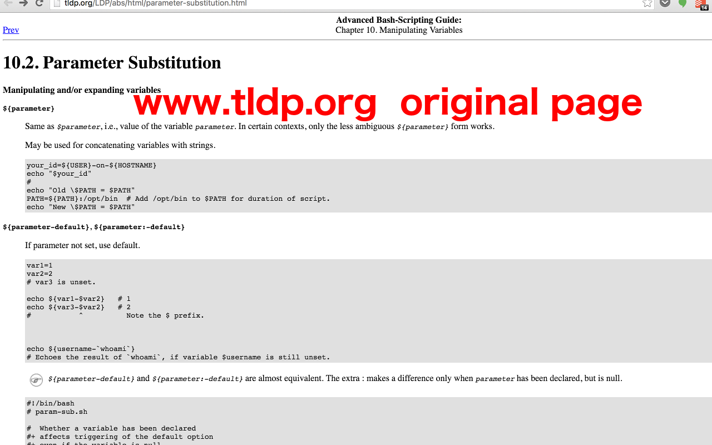

This is a chrome extension, please download at [Google Chrome Web Store](https://chrome.google.com/webstore/detail/tldp-companion/feecfpbibhpnlbnpoclkdhgbclgdpjba) it works with www.tldp.org (TLDP, The Linux Documentation Project), it does the following:

- Add click to copy button on every code block on www.tldp.com web page, copy is much easier
- Add code highlight to code block on web page, so code is more readable
- Add more styles to some page elements(especially tables), the page looks much better

