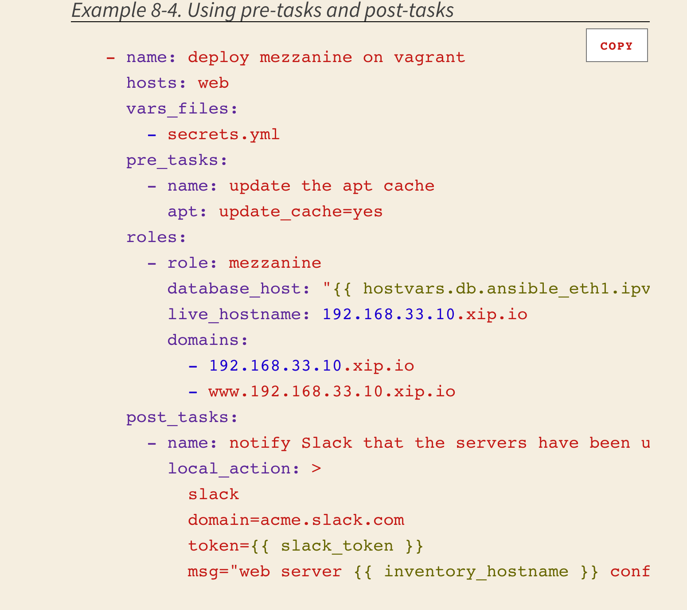
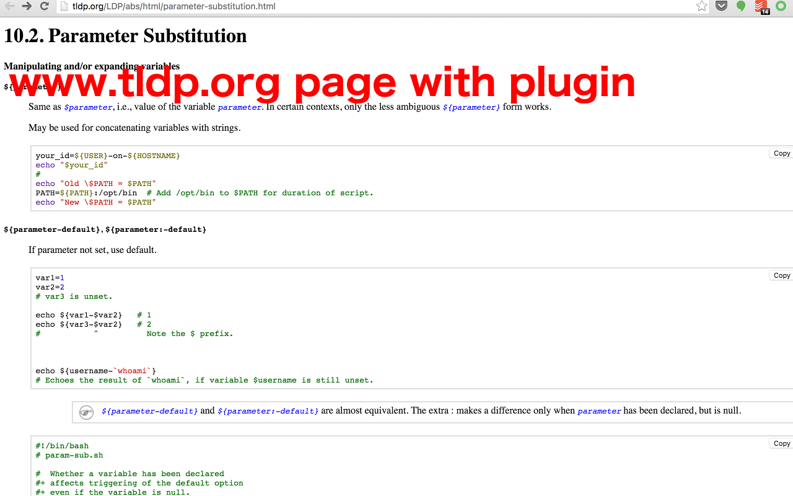

This is a chrome extension, available at [Google Chrome Web Store](https://chrome.google.com/webstore/detail/tldp-companion/feecfpbibhpnlbnpoclkdhgbclgdpjba).

### Support: https://www.safaribooksonline.com

- Remove default code styles, highlight code blocks with highlight.js
- Add click to copy handler to do one click copy

### Support: http://www.tldp.org

- Add click to copy button to every code block on http://www.tldp.com website, copy is much easier
- Add code highlight to code block on web page, so code is more readable
- Add more styles to some page elements(especially tables), to improve the readability

